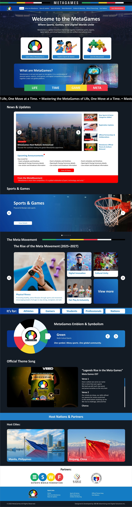

# ESWF METAGAMES WEBSITE

## Instructions

- Convert the existing vanilla CSS website using **Tailwind CSS v4**
- Use **Tailwind CLI** for installation
- Create new repository
- Use hydration technique to inject dynamic content into components using ES6 Modules
- Use collaborator with your new member, a commit should define a specific change, not just a one-time single commit, all members should have contributions to the projec

## Mockup Images

### Mockup 1

### Mockup 2

